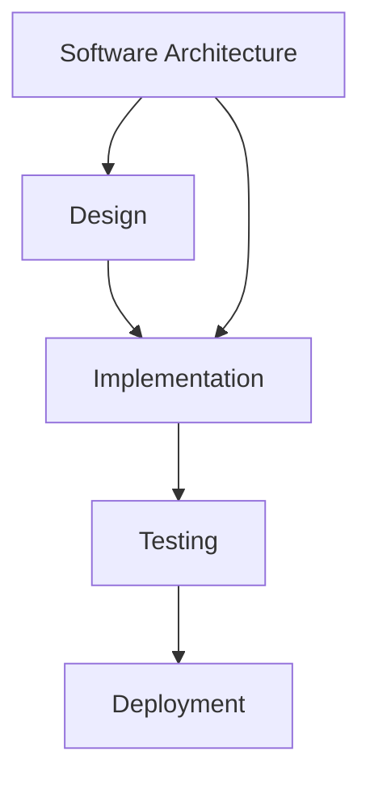

###  **Introduction**
- **Analogies from Physical Structures**:
  - The structure (architecture) of a system defines its **intent** and **qualities**.
  - Example: A theater (for performances) vs. a residential home (for living). 
  - Incorrect structure leads to poor user experience and inefficiency.
- **Software Architecture Implications**:
  - Impacts performance, scalability, ease of adding features, team collaboration, fault tolerance, and security.
  - Poor architectural choices lead to high redesign costs, especially in large systems.

---

### **Formal Definition of Software Architecture**
- **Definition**:
  - A **high-level description** of the system structure, its components, and their interactions to meet requirements and constraints.
- **Breaking Down the Definition**:
  1. **High-Level Abstraction**:
     - Focuses on critical components and hides implementation details.
     - Not about technologies/frameworks (implementation details).
  2. **Components & Communication**:
     - Components are **black boxes** defined by behavior and APIs.
     - May recursively include subsystems with their own architectures.
  3. **Requirements & Constraints**:
     - Architecture must fulfill **functional requirements** (what the system does) and **constraints** (what it must avoid).

---

### **Importance in Large-Scale Systems**
- **Scope**:
  - Focus on **distributed, multi-service architectures** (e.g., ride-sharing apps, social media, video-on-demand).
  - Enables handling high traffic, large datasets, and millions of users.
- **Impact**:
  - Good architecture: Key to scaling from startup to large enterprise.
  - Poor architecture: Wastes time/resources, leads to difficult/expensive redesigns.

---

### **Software Development Cycle**
- **Phases**:
  1. **Design** → Output: **Software Architecture**.
  2. **Implementation** → Input: Architecture.
  3. **Testing**
  4. **Deployment**
- **Iterative Process**:
  - Cycles repeat as systems evolve.
  - First iteration (initial design) is **most critical**; later iterations make incremental changes.
- **Challenges**:
  - Architecture cannot be "proven" optimal (unlike algorithms).
  - Success relies on methodical design processes, patterns, and best practices.

---

###  **Summary**
  1. Architecture defines a system’s structure and behavior.
  2. Critical for scalability, performance, and maintainability.
  3. Output of the **design phase**, guiding implementation.
  4. Requires balancing requirements, constraints, and component interactions.

---

## Diagram: Software Development Cycle

