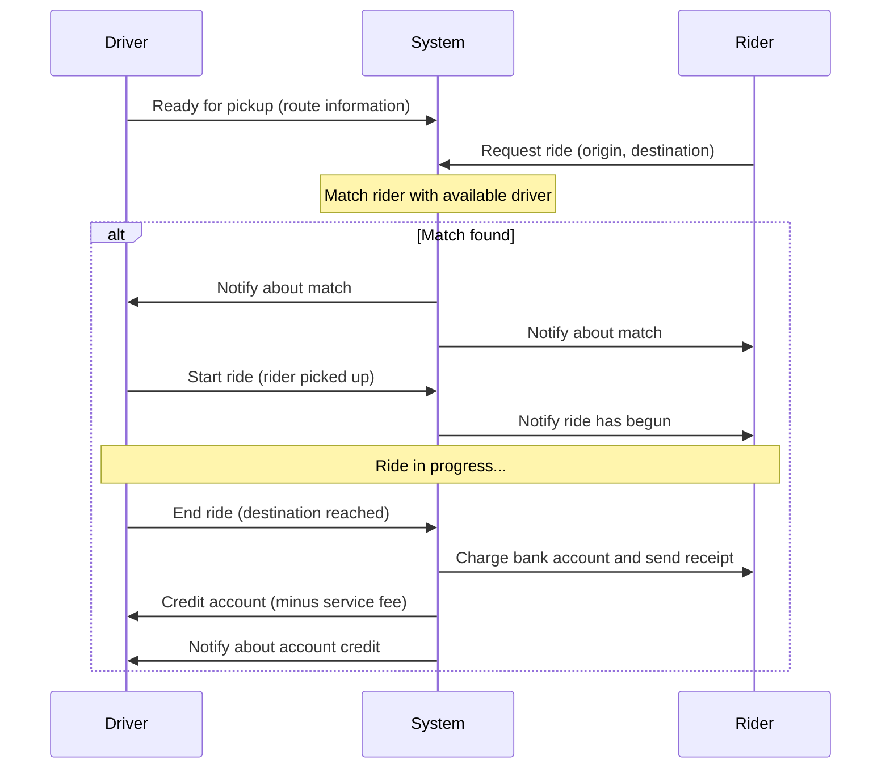

### Capturing Functional Requirements with Use Cases and User Flows

 We're going to continue our discussion about systems requirements and learn about a formal step by step method together and visualize the functional requirements of our system

### Challenges in Capturing Requirements

We talked about the importance of gathering all the requirements for our system before starting designing our system architecture. And we also talked about the challenges in capturing those requirements which involve ambiguity as well as the large scope.

So one native way we can go about it, is to just ask the client to describe everything they need our system to do hoping that they do not forget any detail. However, for complex systems with many features and multiple actors involved, this is not a good approach.

### A Methodical Approach: Use Cases and User Flows

A more powerful and methodical way of gathering requirements and capturing the important features of the desired system, is through use cases and user flows.

- **Use Case**: A use case is a particular situation or scenario in which our system is used to achieve a user's goal.
- **User Flow**: A user flow is a more detailed step by step or graphical representation of each such use case.

### Three-Step Process for Capturing Functional Requirements

So the steps in capturing all the functional requirements in a formal way are as follows:

1. **Identify all the actors or users in our system** - otherwise we will likely not capture all their relevant use cases.
2. **Describe all the possible use cases or scenarios** - in which an actor or user can use our system.
3. **Expand each use case** - through a flow of events or interactions between the actor and our system and in each event in this interaction we capture the action and also take note of the data that flows with it to, and from our system.

### Example: Hitchhiking Service

### Step 1: dentify all the actors or users in our system

If we continue with the hitchhiking service example we mentioned in the previous article, that allows people to join drivers that are already driving on a particular route and are willing to take passengers on their way for a fee in this case, **we only have two actors**, the driver willing to take passengers and the rider.

### Step 2: Use Cases for the Hitchhiking Service

Now, let's take the second step and find all the use cases where a driver or a rider interacts with our hitchhiking service. For example:

- One use case is the registration of a new rider to our system the first time.
- Similarly, we have a registration of a new driver to our service, it's another use case.
- Another use case is logging in of an existing user to our system to initiate a ride.
- Similarly, we have the use case where a driver logs in and is willing to pick up a rider.
- Then we have a successful match between a rider and a driver, which starts and completes a ride.
- And finally, we have the use case where we an unsuccessful match where in other words, a rider could not find a driver that is willing to pick him up.

Of course, these are not all the use cases but we get the idea.

### Step 3: Expanding a Use Case with a Sequence Diagram

Now let's walk through an example of expanding the most interesting use case of a successful match between a rider and a driver.

#### Understanding Sequence Diagrams

There are many ways we can represent the flow of actions in a user flow, the way we're going to represent it is through what's called a sequence diagram. Generally, a sequence diagram is a type of diagram that represents the interactions between actors and objects. This type of diagram is part of a Unified Modeling Language which is a standard for visualizing system design.

It's important to point out that in practice, UML diagrams are used mostly for software design and there is no real standard for representing software architecture in a high level. Furthermore, UML as a language is not strictly followed in the industry but sequence diagrams are still frequently used to represent interactions between different entities in the system and not just objects.

**In a sequence diagram:**

- The time goes from top to bottom.
- Each entity is represented as a vertical line.
- The communication between the entities is represented by arrows, going from one entity to another entity.
- While responses are represented as broken lines going from the destination entity to the caller entity.

#### Sequence Diagram: Successful Match in Hitchhiking Service

So now let's walk through an example of expanding the most interesting use case from the hitchhiking service the one that are represents a successful match and the ride starting with the ride initiation and define its entire user flow in the sequence diagram.

# Ride-Sharing Service Sequence Flow

